## Past Selected Projects

### Data Mining & Machine Learning 
- [User Gender Classification on Reddit applying NLP](https://github.com/pitmonticone/RedditTextClassification);
- [BERT Sentiment Classification on the IMDb Large Movie Review Dataset](https://github.com/pitmonticone/BertSentimentClassification);
- [Dataset Analysis and CNN Models Optimization for Plant Disease Classification](https://github.com/pitmonticone/PlantDiseaseClassification).

### Time Series Analysis 
- [UnrollingAverages.jl](https://github.com/InPhyT/UnrollingAverages.jl): A Julia Package to Deconvolve Time Series Data.

### Applied Graph Theory / Network Science 
- [MultilayerGraphs.jl](https://github.com/JuliaGraphs/MultilayerGraphs.jl): A Julia Package to Construct, Handle and Analyse Multilayer Graphs.

## Current Selected Projects  

### Libraries 
- [LeanBlueprint](https://github.com/PatrickMassot/leanblueprint): Python library to write blueprints for formalisation projects in the Lean proof assistant.
- [Mathlib](https://github.com/leanprover-community/mathlib4): Lean library of formalised mathematics.

### Harmonic Analysis
- [BonnAnalysis](https://github.com/fpvandoorn/BonnAnalysis): Collaborative formalisation seminars in Analysis at the University of Bonn. 
- [Carleson](http://florisvandoorn.com/carleson): Formalising a generalised Carleson's Theorem in the Lean proof assistant.

### Number Theory
- [FLT3](https://pitmonticone.github.io/FLT3): Formalising Fermat's Last Theorem for Exponent 3 in the Lean proof assistant.
- [FLT](https://github.com/ImperialCollegeLondon/FLT): Formalising Fermat's Last Theorem in the Lean proof assistant.
- [PFR](https://github.com/teorth/pfr): Formalising the Polynomial Freiman Ruzsa conjecture and related results in the Lean proof assistant.
- [PNT+](https://github.com/AlexKontorovich/PrimeNumberTheoremAnd): Formalising the Prime Number Theorem and more in the Lean proof assistant.

### Dynamical Systems Theory
- [BET](https://github.com/mseri/BET): Formalising Birkhoff's Ergodic Theorem in the Lean proof assistant.
- [TopologicalEntropy](https://github.com/mseri/BET/tree/main/BET/TopologicalEntropy): Formalising topological entropy in the Lean proof assistant and integrating it into Mathlib.

### Mathematical Physics 
- [HepLean](https://github.com/HEPLean/HepLean): Formalising high energy physics in the Lean 4 proof assistant.

## Talks 

### 2023 

#### [18th Workshop on Algorithms and Models for Web Graphs](http://www.fields.utoronto.ca/activities/22-23/waw2023)

- **When:** 2023/05/23 - 2023/05/26
- **Where:** [The Fields Institute](http://www.fields.utoronto.ca/), Toronto, Canada
- **Who:** [Pietro Monticone](https://github.com/pitmonticone) and [Claudio Moroni](https://github.com/ClaudMor)
- **What:** "Multilayer Network Science in Julia with [`MultilayerGraphs.jl`](https://github.com/JuliaGraphs/MultilayerGraphs.jl)" ([Website](http://www.fields.utoronto.ca/talks/Multilayer-Network-Science-Julia-MultilayerGraphsjl), [Slides](https://inphyt.github.io/Talks/2023/WAW/index.html), [Video](https://youtu.be/hB8Vrwkwax0))

#### [JuliaCon 2023](https://juliacon.org/2023/)

- **When:** 2023/07/25 - 2023/07/29
- **Where:** [Massachusetts Institute of Technology](https://www.mit.edu), Cambridge, MA, USA
- **Who:** [Pietro Monticone](https://github.com/pitmonticone) and [Claudio Moroni](https://github.com/ClaudMor)
- **What:** "[`MultilayerGraphs.jl`](https://github.com/JuliaGraphs/MultilayerGraphs.jl): Multilayer Network Science in Julia" ([Website](https://pretalx.com/juliacon2023/talk/MS7YWQ/), [Short Presentation](https://inphyt.github.io/Talks/2023/JuliaCon/short/index.html), [Long Presentation](https://inphyt.github.io/Talks/2023/JuliaCon/long/index.html), [Video](https://youtu.be/Q2PwKQCkZJ4))

